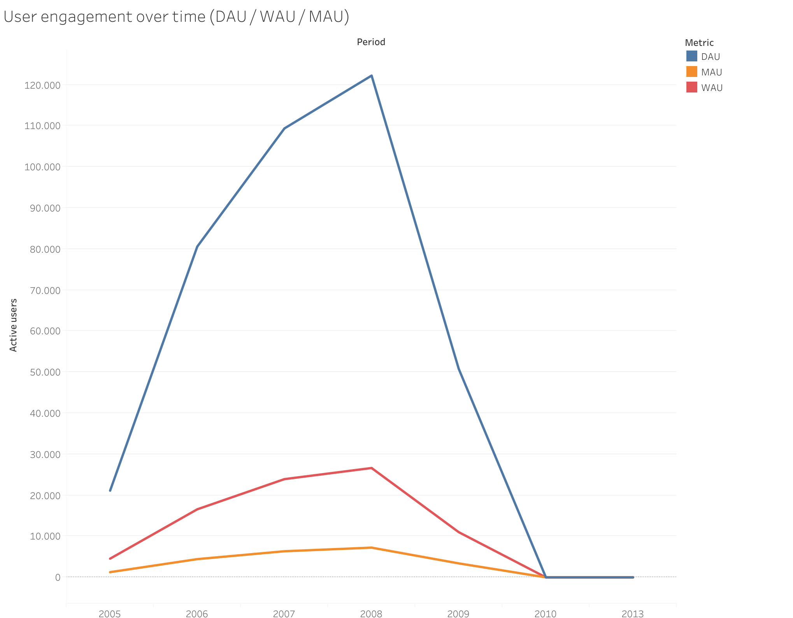
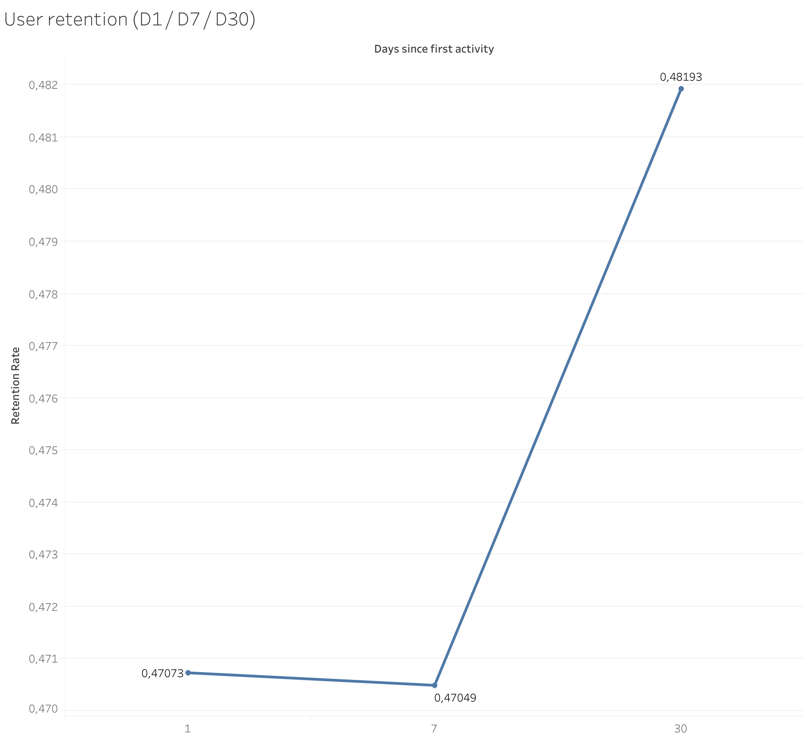
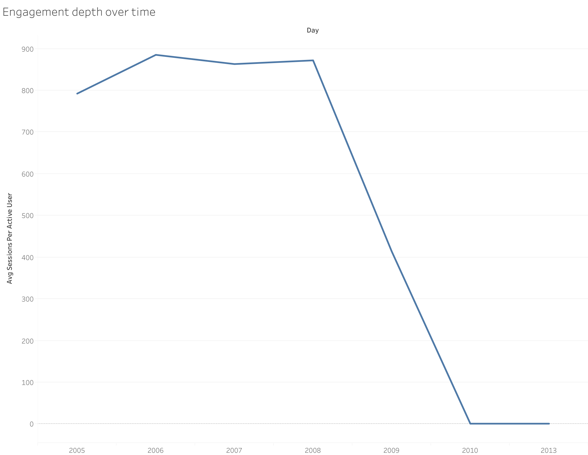

# Spotify-Style Product Analytics (SQL + Tableau)

This project demonstrates a **SQL-first product analytics workflow** inspired by how music-streaming products (e.g. Spotify) measure engagement, activation, retention, and depth of usage.

Raw listening events are transformed into **interpretable product metrics** using PostgreSQL.  
Final metrics are then visualized in **Tableau Public** to communicate insights clearly.

---

## Dataset

This project uses the **Last.fm 1K Users dataset**, a widely used public dataset containing timestamped music listening events.

- **Source:** Last.fm / MTG-UPF  
- **Coverage:** ~1,000 users, multiple years of listening history  
- **Data type:** user–artist–track interactions with timestamps  

The dataset is commonly used for research in music recommendation, user behavior analysis, and streaming analytics.  
All metrics in this project are derived solely from these listening events.
---

## Project overview

**Goal:**  
Analyze user engagement and retention for a music-streaming platform using realistic product analytics metrics.

**Key questions answered:**
- Are users active over time? (DAU / WAU / MAU)
- Do new users reach value quickly? (24h activation)
- Do users come back? (D1 / D7 / D30 retention)
- How deeply do users engage when active? (sessions per user)

---

## Tech stack

- **PostgreSQL** — core metric computation (SQL-first)
- **Python** — lightweight preprocessing & CSV export
- **Tableau Public** — stakeholder-facing visualization
- **DBeaver** — database exploration & CSV export

---

## Repository structure

```
.
├── python/
│   └── spotify_analytics_data_acquistion.ipynb
│
├── SQL/
│   ├── schema-spotify-analytics.sql
│   ├── build_sessions+saves_spotify.sql
│   └── queries/
│       ├── product_metrics_spotify.sql.sql
│       ├── activation_spotify.sql.sql
│       ├── spotify_retention.sql
│       └── engagement_spotify.sql.sql
│
├── tableau_graphics/
│   ├── dau_wau_mau.png
│   ├── tableau_retention.png
│   └── tableau_engagement_depth.png
│
└── README.md
```

---

## Data & preprocessing (`python/`)

Python is used **only** for:
- loading the raw dataset
- basic cleaning
- exporting CSVs for ingestion into PostgreSQL

All business logic and metrics are computed in SQL.  
This mirrors real analytics pipelines where Python handles ingestion and SQL handles analysis.

---

## SQL analytics layer (`sql/`)

All core product logic lives in PostgreSQL.

### Schema & derived tables
The file `schema_and_derived_tables.sql` defines:
- base tables (`users`, `plays`)
- derived tables:
  - `sessions` — inferred using a 30-minute inactivity rule
  - `saves` — proxy signal based on repeated listens

### Metric queries (`sql/queries/`)

Each query produces a **final, visualization-ready metric table**:

- **Active users** — DAU / WAU / MAU  
- **Activation** — % of users with first play within 24 hours  
- **Retention** — D1 / D7 / D30 cohort-based retention  
- **Engagement depth** — average sessions per active user  

---

## Tableau dashboards & key insights (`tableau_graphics/`)

Metrics computed in SQL are exported as CSVs and visualized in **Tableau Public**.

> Tableau Public does not support direct PostgreSQL connections, so final metric tables are exported and used as data sources.  
> This keeps all business logic in SQL and Tableau focused purely on communication.

---

### User engagement over time (DAU / WAU / MAU)



**Key insights**
- DAU, WAU, and MAU grow steadily until 2008, indicating increasing user adoption and engagement.
- The large gap between DAU and MAU suggests many users engage episodically rather than daily, a common pattern in music streaming.
- The sharp decline after 2009 reflects dataset coverage rather than a real product collapse and highlights the importance of understanding data boundaries.

---

### User retention (D1 / D7 / D30)



**Key insights**
- Day‑1 and Day‑7 retention are very similar, suggesting that users who return once are likely to come back again shortly after.
- Higher Day‑30 retention indicates a subset of users that develop long‑term listening habits.
- This pattern is consistent with products where initial exploration is common but sustained engagement concentrates among power users.

---

### Engagement depth (sessions per active user)



**Key insights**
- Engagement depth remains high during peak years, indicating that active users listen in multiple sessions per day.
- The sharp drop in later years mirrors the decline in active users and reflects reduced dataset activity rather than reduced individual engagement.
- Combined with retention, this suggests that while the user base thins over time, remaining users are highly engaged.

---

## Key assumptions & proxies

To reflect real-world constraints, the following assumptions are used:

- **Activation**: a user is considered activated if they play a track within 24h of signup (or first-seen date if signup is missing)
- **Retention**: cohort-based, measured at D1 / D7 / D30
- **Sessions**: inferred using a 30-minute inactivity threshold
- **Saves**: proxied via repeated listens due to missing explicit “like” events

All assumptions are documented and intentionally conservative.

---

## Why this project

This project is designed to mirror **real product analytics work**, not academic exercises:
- SQL-first metric definitions
- Clear separation between computation and visualization
- Focus on interpretable, decision-relevant KPIs
- No over-engineering or black-box modeling

It reflects how analytics teams communicate product health to stakeholders.

---

## Potential extensions

- Retention segmented by geography or activity level
- Funnel analysis (signup → first play → repeat play)
- Cohort heatmaps in Tableau
- Playlist- or artist-level engagement analysis

---

## Author

Phillip Olshausen  
Master’s student — Data Science & Quantitative Finance 
Focus: data science, product analytics, and music-related applications
